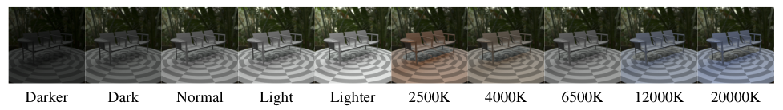
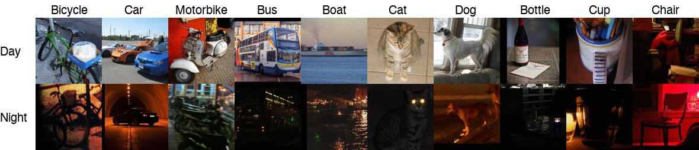
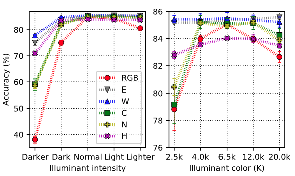

# Zero-Shot Day-Night Domain Adaptation with a Physics Prior

[[arXiv](https://arxiv.org/abs/2108.05137)] [[sup. material](supplementary_material.pdf)] - ICCV 2021 Oral paper, by [Attila Lengyel](https://attila94.github.io), [Sourav Garg](https://staff.qut.edu.au/staff/s.garg), [Michael Milford](https://research.qut.edu.au/qcr/Our%20people/michael-milford/) and [Jan van Gemert](http://jvgemert.github.io/index.html).

This repository contains the PyTorch implementation of Color Invariant Convolutions and all experiments and datasets described in the paper.

## Abstract
We explore the zero-shot setting for day-night domain adaptation. The traditional domain adaptation setting is to train on one domain and adapt to the target domain by exploiting unlabeled data samples from the test set. As gathering relevant test data is expensive and sometimes even impossible, we remove any reliance on test data imagery and instead exploit a visual inductive prior derived from physics-based reflection models for domain adaptation. We cast a number of color invariant edge detectors as trainable layers in a convolutional neural network and evaluate their  robustness to illumination changes. We show that the color invariant layer reduces the day-night distribution shift in feature map activations throughout the network. We demonstrate improved performance for zero-shot day to night domain adaptation on both synthetic as well as natural datasets in various tasks, including classification, segmentation and place recognition.

## Getting started

All code and experiments have been tested with PyTorch 1.7.0.

Create a local clone of this repository:
```bash
git clone https://github.com/Attila94/CIConv
```

The `method` directory contains the color invariant convolution (CIConv) layer, as well as custom ResNet and VGG models using the CIConv layer. To use the CIConv layer in your own architecture, simply copy `ciconv2d.py` to the desired directory and add it as a regular PyTorch layer as

```python
from ciconv2d import CIConv2d
ciconv = CIConv2d('W', k=3, scale=0.0)
```

See `resnet.py` and `vgg.py` for examples.

### Datasets

#### Shapenet Illuminants

[[Download link](https://data.4tu.nl/articles/dataset/Shapenet_Illuminants_-_dataset_from_Zero-Shot_Day-Night_Domain_Adaptation_with_a_Physics_Prior_/15141273)]

Shapenet Illuminants is used in the synthetic classification experiment. The images are rendered from a subset of the [ShapeNet](https://shapenet.org) dataset using the physically based renderer [Mitsuba](https://www.mitsuba-renderer.org). The scene is illuminated by a point light modeled as a black-body radiator with temperatures ranging between *[1900, 20000] K* and an ambient light source. The training set contains 1,000 samples for each of the 10 object classes recorded under "normal" lighting conditions (*T = 6500 K*). Multiple test sets with 300 samples per class are rendered for a variety of light source intensities and colors.



#### Common Objects Day and Night

[[Download link](https://github.com/Attila94/CODaN)]

Common Objects Day and Night (CODaN) is a natural day-night image classification dataset. More information can be found on the separate Github repository: https://github.com/Attila94/CODaN.



### Experiments

#### 1. Synthetic classification

1. Download [[link](https://data.4tu.nl/articles/dataset/Shapenet_Illuminants_-_dataset_from_Zero-Shot_Day-Night_Domain_Adaptation_with_a_Physics_Prior_/15141273)] and unpack the Shapenet Illuminants dataset.
2. In your local CIConv clone navigate to `experiments/1_synthetic_classification` and run
```bash
python train.py --root 'path/to/shapenet_illuminants' --hflip --seed 0 --invariant 'W'
```

This will train a ResNet-18 with the 'W' color invariant from scratch and evaluate on all test sets.



Classification  accuracy  of  ResNet-18  with  various  color  invariants. RGB (not invariant) performance degrades when illumination conditions differ between train and test set, while color invariants remain more stable. *W* performs best overall.

Trained model weights for the baseline and 'W' color invariant are available in the experiment subdir.

#### 2. CODaN classification

1. Download the Common Objects Day and Night (CODaN) dataset from https://github.com/Attila94/CODaN.
2. In your local CIConv clone navigate to `experiments/2_codan_classification` and run
```bash
python train.py --root 'path/to/codan' --invariant 'W' --scale 0. --hflip --jitter 0.3 --rr 20 --seed 0
```

This will train a ResNet-18 with the 'W' color invariant from scratch and evaluate on all test sets.

**Selected results from the paper:**
| Method   | Day (% accuracy) | Night (% accuracy) |
| -------- | ----------------- | ----------------- |
| Baseline | 80.39 +- 0.38     | 48.31 +- 1.33     |
| *E*       | 79.79 +- 0.40     | 49.95 +- 1.60     |
| *W*       | **81.49 +- 0.49** | **59.67 +- 0.93** |
| *C*       | 78.04 +- 1.08     | 53.44 +- 1.28     |
| *N*       | 77.44 +- 0.00     | 52.03 +- 0.27     |
| *H*       | 75.20 +- 0.56     | 50.52 +- 1.34     |

Trained model weights for the baseline and 'W' color invariant are available in the experiment subdir.

#### 3. Semantic segmentation

1. Download and unpack the following public datasets: [Cityscapes](https://www.cityscapes-dataset.com), [Nighttime Driving](http://data.vision.ee.ethz.ch/daid/NighttimeDriving/NighttimeDrivingTest.zip), [Dark Zurich](https://data.vision.ee.ethz.ch/csakarid/shared/GCMA_UIoU/Dark_Zurich_val_anon.zip).

2. In your local CIConv clone navigate to `experiments/3_segmentation`.

3. Set the proper dataset locations in `train.py`.

4. Run

   ```bash
   python train.py --hflip --rc --jitter 0.3 --scale 0.3 --batch-size 6 --pretrained --invariant 'W'
   ```

**Selected results from the paper:**

| Method               | Nighttime Driving (mIoU) | Dark Zurich (mIoU) |
| -------------------- | ------------------------ | ------------------ |
| RefineNet [baseline] | 34.1                     | 30.6               |
| *W*-RefineNet [ours] | **41.6**                 | **34.5**           |

Trained model weights for the baseline and 'W' color invariant are available [here](https://gitlab.tudelft.nl/attilalengyel/ciconv/-/tree/master/experiments/3_segmentation).

#### 4. Visual place recognition

1. Setup conda environment

   ```bash
   conda create -n ciconv python=3.9 mamba -c conda-forge
   conda activate ciconv
   mamba install pytorch==1.7.1 torchvision==0.8.2 torchaudio==0.7.2 cudatoolkit=10.1 scikit-image -c pytorch
   ```
2. Navigate to `experiments/4_visual_place_recognition/cnnimageretrieval-pytorch/`.

3. Run

   ```bash
   git submodule update --init # download a fork of cnnimageretrieval-pytorch
   sh cirtorch/utils/setup_tests.sh # download datasets and pre-trained models 
   python3 -m cirtorch.examples.test --network-path data/networks/retrieval-SfM-120k_w_resnet101_gem/model.path.tar --multiscale '[1, 1/2**(1/2), 1/2]' --datasets '247tokyo1k' --whitening 'retrieval-SfM-120k'
   ```
4. Use `--network-path retrievalSfM120k-resnet101-gem` to compare against the vanilla method (without using the color invariant trained ResNet101).

5. Use `--datasets 'gp_dl_nr'` to test on the GardensPointWalking dataset. 

**Selected results from the paper:**

| Method                   | Tokyo 24/7 (mAP) |
| ------------------------ | ---------------- |
| ResNet101 GeM [baseline] | 85.0             |
| *W*-ResNet101 GeM [ours] | **88.3**         |

## Citation

If you find this repository useful for your work, please cite as follows:

```
@InProceedings{Lengyel_2021_ICCV,
    author    = {Lengyel, Attila and Garg, Sourav and Milford, Michael and van Gemert, Jan C.},
    title     = {Zero-Shot Day-Night Domain Adaptation With a Physics Prior},
    booktitle = {Proceedings of the IEEE/CVF International Conference on Computer Vision (ICCV)},
    month     = {October},
    year      = {2021},
    pages     = {4399-4409}
}
```

